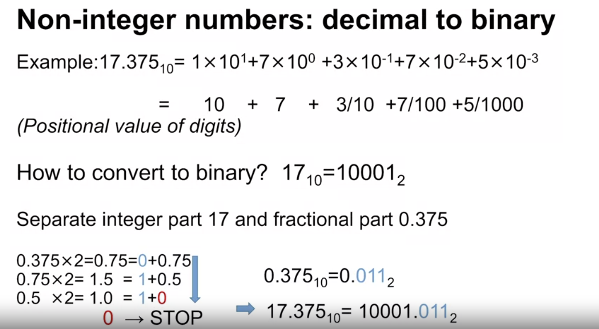

[Week 1 Summary](../Week%201%20Introduction%20to%20number%20bases%20-%20%20conversion%20to%20decimal/Week%201%20Summary.md) for related details on number conversion. 


###  Non int numbers : Decimal to Binary 


- Non integer number conversion is not much different from integer number only with slight additional calculation for anything after fraction

eg: I want to convert 17.375 into binary 
1. Proceed with the standard conversion for integers before fraction
2. For fractional point, use the $a^-1$ , $a^-2$... for conversion

*The actual conversion calculation*
```
1 x 10^1 + 7 x 10^0 + 3 x 10^-1 + 7 x 10^-2 + 5 x 10^-3

= 10 + 7 + 3/10 + 7/100 + 5/1000
```
3. For all digits before the decimal point, proceed with the standard conversion
	 - Converting 17 to binary
		 17 / 2 = 6r1
		 6  / 2 = 3r0
		 3 / 2  = 1r1
		 1 / 2 = 0r 1
		 = 1101 ( Read from bottom to up )
	 - Converting 0.375 to binary
		 - 0.375 x 2 = 0.75 ( 0 + 0.75 )
		-  0.75 x 2 = 1.5 (1 + 0.5 )
		-  0.5 x 2 = 1 ( 1 + 0 )
		-  0 --> **stop**
			-  = 011 ( Read from top to down )
	
  - **1101.011**

### Non int numbers : Binary to Decimal
