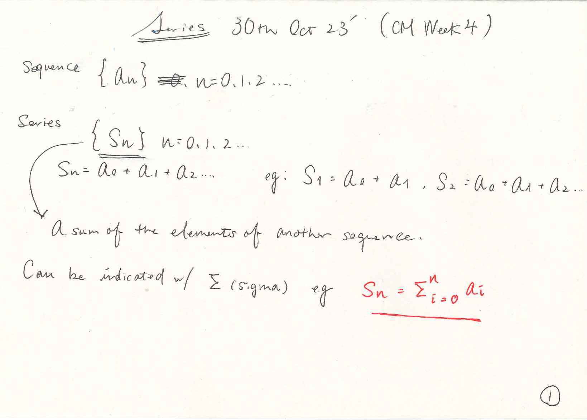

### Series
- A sequence derived from another sequence

### Mathematical Induction
- [Wikipedia Link](https://en.wikipedia.org/wiki/Mathematical_induction)
- [BYJUS: Principle of Mathematical Induction ](https://byjus.com/maths/principle-of-mathematical-induction-learn-examples/)

