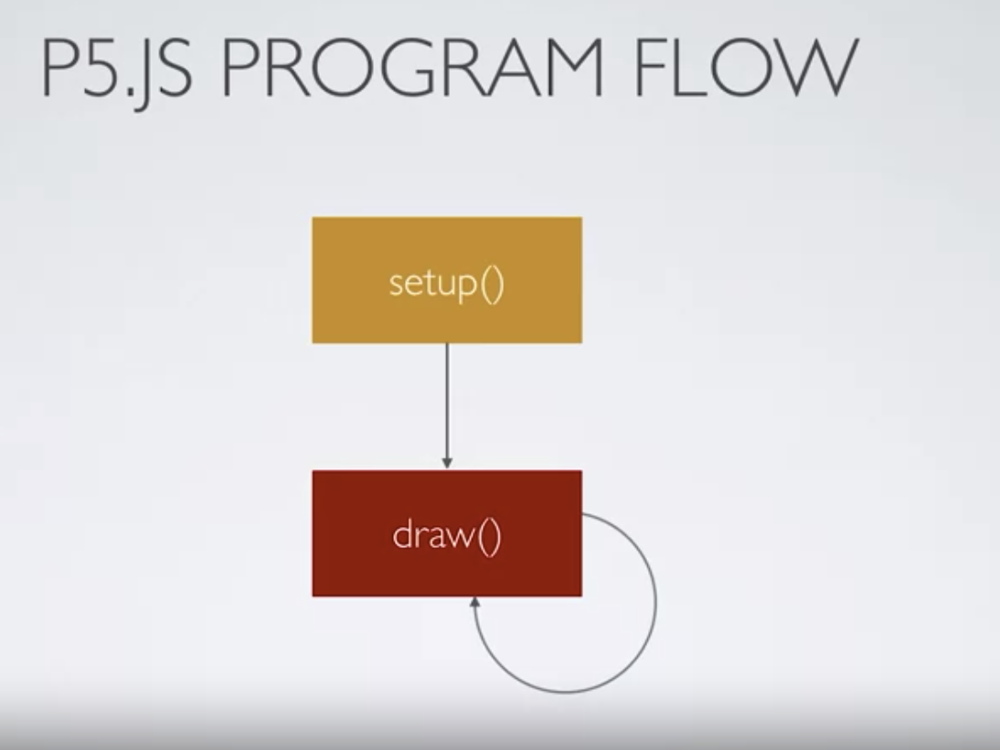

### RGB Value
- In RGB ( Colour ) we use 0 to 255 per value
	- This is because we define each RGB value within 1 byte
		- **Why is it 1 byte and not 2 bytes** ? There are possibly several reasons
			1. **Storage issue**: 1byte is an efficient amount of data. If it's something bigger than 1 byte, it might make the colour representation less efficient
			2. **Human ability** : Humans cannot distinguish granular colour differences and therefore there is no point of having so many colour representation. For example, if we set each rgb maximum value to 2 bytes, it means we can have 0 to 65,535  each. 
			3. **Conventions**: Almost every software and hardware we have uses 1 byte for RGB representation. If we suddenly decide to change to different storage size, this might become disruptive. 
- Useful tools ?
	- [Rapid Tables Colour Chart](https://www.rapidtables.com/web/color/RGB_Color.html)
	- [Colorhexa : Colour Encyclopedia](https://www.colorhexa.com/)

### fill() stroke() and nofill()
- fill() --> To set colour of the object
	- You can call fill() every time before drawing a shape to have different colour by shapes
- stroke() --> To set colour of the outline
- nofill() --> To remove any fill()
- nostroke()  --> To remove any outline

### setup() and draw()
- In p5.js, you setup the canvas at setup() and draw() draws object on the screen. 

### Console View
- Console, or developer tool is usually a browser built in tool where you can debug or log website data including HTML , CSS, JS and something more advanced such as request/response
- 