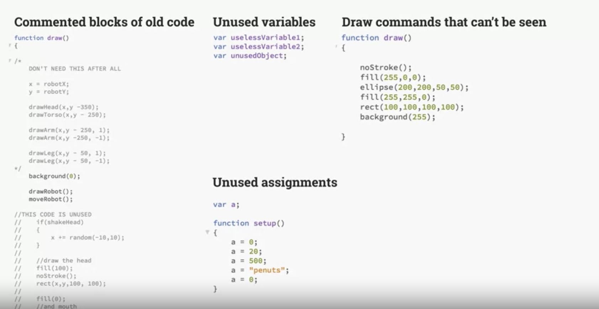

### Elegant Code

The Idea of 'elegant code' is often discussed among professional programmers. While the answer to 'elegant coding' can be contentious, the common ideas are as below
1. Well named variables
2. Good use of objects
3. Logical organisation
4. Explanatory comments
5. Follow conventions and guidelines explicitly mentioned. 

The code which are not elegant, a redundant codes are and should be avoided

